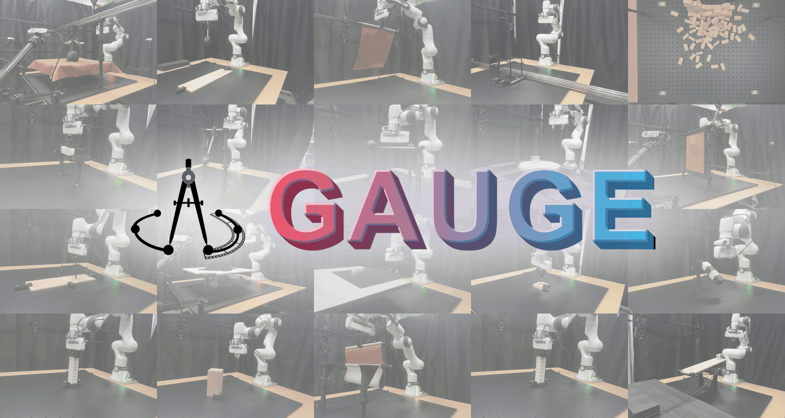

<div align="right">
English | <a href="README.zh-CN.md">简体中文</a>
</div>

<div align="center">
  
# GAUGE: A Measurement-Grounded Benchmark for Physical Fidelity in Simulation Engines and Video World Models
**From visual plausibility to measurement-grounded physical fidelity.**
*Released by [Shanghai AI Laboratory](https://www.shlab.org.cn/).*

<p align="center">
  <a href="https://internrobotics.github.io/GAUGE/"></a>
  <a href="https://arxiv.org/abs/2608.05948"></a>
  <a href="LICENSE"></a>
  <a href="https://huggingface.co/datasets/InternRobotics/GAUGE-Dataset"></a>
</p>

<p align="center">
  
</p>
</div>

> **Visual realism does not imply physical fidelity.**
> GAUGE evaluates whether physics engines and video world models reproduce real-world physical behavior — and diagnoses *which physical mechanisms they fail to reproduce*.

**GAUGE** is a real-world-grounded benchmark for evaluating the physical fidelity of both **numerical physics engines** and **generative video world models**.

Instead of relying primarily on visual similarity or human judgments, GAUGE compares simulated or generated dynamics against **controlled real-world experiments**, using measured trajectories, calibrated physical parameters, uncertainty estimates, and task-specific physical observables.

GAUGE provides:

* **22 controlled physical task families**
* **~1,560 real-world motion-capture trials**
* **Rigid, cable, textile, and volumetric deformable objects**
* **Experimentally calibrated physical parameters**
* **Millimeter-level trajectory measurements**
* **Physics-engine and video-world-model evaluation tracks**
* **Task-specific diagnostic metrics and standardized evaluation protocols**

---

## 🔥 News

* **2026-09** — GAUGE code and evaluation toolkit released.
* **2026-08** — Real-world benchmark data released.
* **2026-08** — Physics-engine and video-world-model baselines released.

---

## 🌍 What is GAUGE?

Physics simulators are increasingly used for robot learning, policy evaluation, and large-scale synthetic data generation. Meanwhile, generative video models are emerging as implicit simulators capable of predicting future interactions.

But a fundamental question remains:

> **How physically faithful are these simulators to the real world?**

A rollout can look realistic while still having the wrong friction, acceleration, momentum transfer, oscillation period, deformation, or energy behavior.

GAUGE addresses this problem by grounding evaluation in **controlled real-world physical experiments**.

Each task provides:

**Real Experiment → Physical Measurement → Matched Simulation / Video Generation → Observation Extraction → Physics Evaluation**

This allows GAUGE to go beyond asking whether a rollout *looks plausible* and instead ask:

1. Does the trajectory match real-world dynamics?
2. Does the motion obey the expected physical law?
3. Are the underlying physical parameters correct?
4. Is the behavior temporally stable?
5. Which physical mechanism causes the failure?

---

## ✨ What Makes GAUGE Different?

### 📏 Measurement-Grounded

GAUGE uses repeated real-world experiments rather than simulator-generated reference trajectories.

Experiments are recorded using a high-precision motion-capture system and paired with calibrated physical metadata.

### 🧩 Cross-Regime Physics

One benchmark covers multiple physical regimes:

| Regime                     | Tasks | Representative Physics                              |
| -------------------------- | ----: | --------------------------------------------------- |
| Rigid Body                 |     8 | Collision, friction, momentum transfer, oscillation |
| Flexible Cable             |     1 | Self-contact, stretching                            |
| Textile                    |     6 | Stretching, bending, friction, rapid dynamic        |
| Volumetric Deformable Body |     7 | Stretching, compression, shear, twist, bending      |

### ⚙️ Physics Engines + 🌐 World Models

GAUGE evaluates two complementary classes of simulators under a common real-world foundation:

**Simulation-Engine Track**

> Real experiment → matched simulated scene → simulated trajectory → sim-to-real evaluation

**Video World Model Track**

> Initial image + prompt → generated video → motion extraction → physical-law evaluation

### 🔬 Diagnostic, Not Just Ranking

GAUGE is designed to identify *why* a simulator fails.

Evaluation includes trajectory discrepancy, temporal alignment, momentum transfer, oscillation, force-motion consistency, equation-form consistency, and physical-parameter accuracy.

---

## 🧪 Benchmark Tasks

GAUGE contains **22 standardized task families**.

### Rigid Bodies

| Task              | Physical Property              | Materials            |
| ----------------- | ------------------------------ | -------------------- |
| Slope Contact     | Collision                      | Wood, Plastic        |
| Nonsmooth Contact | Codimensional collision        | Wood, Plastic        |
| Slope Slider      | Static & kinetic friction      | Wood, Plastic, Metal |
| Turntable         | Friction in non-inertial frame | Wood, Plastic, Metal |
| Bouncing Ball     | Rapid impact                   | Rubber               |
| Newton's Cradle   | Momentum transfer              | Metal                |
| Wall Breaking     | Dense collision                | Wood                 |
| Pendulum          | Periodic motion                | Metal                |

### Flexible Cable & Textiles

| Task               | Physical Property                    |
| ------------------ | ------------------------------------ |
| Rope Winding       | Self-collision & stretch modulus     |
| Textile Stretching | Stretch modulus                      |
| Textile Bending    | Bending modulus                      |
| Textile Flinging   | High-acceleration deformation        |
| Funnel             | Collision & friction                 |
| Rotating Ball      | Static & kinetic friction            |
| Tablecloth Pulling | Rigid–textile interaction & friction |

Textile materials include rayon, satin, uniform cloth, Oxford fabric, synthetic leather, and nylon taslan.

### Volumetric Deformable Bodies

| Task             | Physical Property              |
| ---------------- | ------------------------------ |
| Foam Stretching  | Stretching modulus             |
| Foam Compressing | Compression modulus            |
| Foam Shearing    | Shear modulus                  |
| Foam Twisting    | Twisting modulus               |
| Foam Bending     | Bending modulus                |
| Stick-Stack      | Friction                       |
| Cantilever Beam  | Large stiffness-ratio coupling |

---

## 📦 Dataset

Each GAUGE task is grounded in repeated physical experiments.

The dataset contains approximately **1,560 motion-capture trials**, together with calibrated physical properties and uncertainty estimates.

### Real-World Measurements

For rigid objects:

```text
local frame
        ↓
6-DoF pose trajectory over time
```

For textiles and volumetric deformable objects:

```text
tracked surface markers
        ↓
position trajectory over time
```

### Physical Metadata

Depending on the task and material, GAUGE provides experimentally characterized quantities including:

* geometry
* mass
* density
* friction
* restitution
* tensile stiffness
* shear stiffness
* bending stiffness
* Young's modulus
* Poisson's ratio

### Dataset Structure

```text
GAUGE/
├── data/                       # Real-world motion-capture trajectories and measurements
│   ├── rigid/                  # Rigid-body experiments (contact, friction, impact, oscillation)
│   ├── rope/                   # Flexible-cable experiment (winding and self-contact)
│   ├── textile/                # Textile experiments (stretching, bending, flinging, friction)
│   └── deformable/             # Volumetric deformable-body experiments (stretch, shear, twist, bend)
│
├── assets/                     # Simulation-ready object and scene assets
│   ├── mjcf/                   # MJCF assets for MuJoCo-based simulation
│   ├── obj/                    # OBJ geometry and mesh files
│   ├── stl/                    # STL geometry files
│   └── usd/                    # USD assets for Isaac Sim and compatible simulators
│
├── metadata/                   # Calibrated physical properties and experiment conditions metadata
│   ├── rigid/                  # Mass, dimensions, density, friction, restitution, etc.
│   ├── rope/                   # Cable geometry and physical-property metadata
│   ├── textile/                # Textile tensile, shear, and bending properties
│   └── deformable/             # Young's modulus, Poisson's ratio, geometry, etc.
│
├── input/                      # Standardized inputs for the video world-model track
│   ├── first_frames/           # Initial real-world frames for video generation
│   └── text_prompts/           # Standardized task prompts for video generation
│
├── scripts/                    # Evaluation scripts for GAUGE benchmark tracks
│   ├── simulation/             # Physics-engine simulation 
│   └── metrics/                # Trajectory and task-specific physical metrics and sim-to-real evaluation
│
├── media/                      # README figures and task visualizations
├── LICENSE                     # Project license
└── README.md                   # Benchmark overview, setup, evaluation, and usage
```

---

## ⚙️ Simulation-Engine Track

The simulation-engine track evaluates whether a numerical simulator reproduces measured real-world dynamics under matched initial conditions and physical parameters.

<p align="center">
  
</p>

GAUGE currently evaluates representative tasks with:

| Physics Engine    | Rigid   | Textile     | Deformable   |
| ----------------- | ------- | ----------- | -----------  |
| [IsaacSim](https://docs.isaacsim.omniverse.nvidia.com/6.0.0/index.html)          | PhysX   | Surface FEM | FEM          |
| [Genesis](https://genesis-world.readthedocs.io/en/v1.2.2/index.html)           | Default | PBD         | Explicit MPM |
| [Newton](https://newton-physics.github.io/newton/1.3.0/guide/overview.html)            | Mujoco  | VBD         | Implicit MPM |

Physical parameters are initialized from GAUGE's experimental calibration rather than task-specific simulator fitting.

### Generalized Trajectory

Different object classes are represented using task-appropriate observables:

| Object                     | Representation                 |
| -------------------------- | ------------------------------ |
| Rigid body                 | Position                       |
| Textile                    | Marker-wise Gaussian curvature |
| Volumetric deformable body | Local mesh-face area           |

This allows different physical regimes to be compared under a common trajectory-evaluation framework while retaining physically meaningful state representations.

### Metrics

Core metrics include:

* **RMSE** — Frame-aligned discrepancy between simulated and mean real-world trajectories.

* **DTW** — Dynamic Time Warping discrepancy, allowing monotonic temporal alignment.

Task-specific metrics additionally include:

* **LSD** — Longest Stationary Duration
* **MTE** — Momentum Transfer Efficiency
* **PD** — Period Duration
* **EL** — Energy Loss

---

## 🌐 Video World Model Track

The world-model track asks a different question:

> Has a generative model learned the underlying physics, or only how physical motion should look?

<p align="center">
  
</p>

Generated objects are segmented and tracked frame by frame, after which pixel trajectories are converted into physical coordinates.

| World Model    | [Cosmos3-Nano](https://research.nvidia.com/labs/cosmos-lab/cosmos3/)   | [Cosmos3-Super](https://research.nvidia.com/labs/cosmos-lab/cosmos3/)     | [Wan-2.2](https://tongyi.aliyun.com/wan/)   | [Wan-2.7](https://www.aliyun.com/benefit/scene/wan)   | [Seedance-2.0](https://www.volcengine.com/activity/seedance2?utm_source=5&utm_medium=sem_bing&utm_term=sem_bing_seedance20_dpcx_gw_tcpa&utm_campaign=76554087640442&utm_content=seedance20_gw_dpcx&msclkid=6f4b574ade8518c8c0473dceec6f04b7)    | [Genie3](https://labs.google/projectgenie?utm_source=deepmind.google&utm_medium=referral&utm_campaign=gdm&utm_content=)     |
| ----------------- | :-------: | :-----------: | :-----------: | :-----------: | :-----------: | :-----------: |
| Positive Prompt   | ✓ | ✓ | ✓ | ✓ | ✓ | ✓ |
| Negative Prompt   | ✓ | ✓ | ✓ | ✓ | × | × |

### Metrics

GAUGE separates **physical-law structure** from **physical-parameter accuracy**.

#### Physical Law Structure

* **Dynamic Error (DE)** — Measures consistency between predicted motion and expected force–motion relationships.

* **Coefficient of Determination (R²)** — Measures how well the expected governing equation explains the generated trajectory.

* **Quadratic Form Improvement (QFI)** — Tests whether unexpected higher-order curvature is needed to explain motion that should follow a simpler physical relationship.

#### Physical Parameters

Task-specific parameters such as:

* **acceleration**
* **momentum-transfer efficiency**
* **oscillation period**
* **damping**

are recovered from generated trajectories and compared with real measurements.

This distinction is important because a generated trajectory may fit the **form** of a physical law while still recovering the **wrong physical parameters**.

---

## 📊 Benchmark Results

### Physics Engines

We benchmark representative GAUGE tasks using:

| Engine    | Rigid | Textile | Volumetric |
| --------- | :---: | :-----: | :--------: |
| Isaac Sim |   ✓   |    ✓    |      ✓     |
| Genesis   |   ✓   |    ✓    |      ✓     |
| Newton    |   ✓   |    ✓    |      ✓     |

A central finding is that **no single physics engine is uniformly faithful across all physical regimes**.

Standard contact and sliding behaviors can often be reproduced reasonably well, while substantially larger discrepancies appear in:

* impulsive contact,
* high-acceleration textile motion,
* volumetric deformation.

### Video World Models

GAUGE additionally evaluates representative image-to-video and interactive world models on rigid-body physical tasks.

The results reveal an important distinction:

> **A model can generate motion with the correct-looking equation form while predicting incorrect physical parameters.**

Examples include incorrect acceleration, momentum transfer, oscillation period, and damping despite visually plausible motion.

---

## 🔎 Understanding Your Results

GAUGE is intended as a **diagnostic benchmark**, not only a leaderboard.

A useful interpretation is:

```text
High visual quality
      │
      ├── Correct equation form?
      │       │
      │       ├── No  → structural physics failure
      │       │
      │       └── Yes
      │            │
      │            ├── Correct parameters?
      │            │       └── No → quantitative physics failure
      │            │
      │            └── Correct temporal behavior?
      │                    └── No → dynamics / stability failure
      │
      └── Compare against real experimental uncertainty
```

The goal is therefore not simply to answer:

> **Which simulator scores highest?**

but rather:

> **Which physical mechanisms does each simulator reproduce faithfully, and where does it deviate from reality?**

---

## 🛣️ Roadmap

Future versions of GAUGE aim to extend the benchmark toward:

* more materials and broader physical-parameter ranges,
* additional rigid/deformable interaction regimes,
* fluid dynamics,
* fluid–rigid interaction,
* fluid–soft-body interaction,
* 3D world-model evaluation,
* reconstructed point-cloud and mesh metrics,
* strain, curvature, bending-energy and energy-dissipation analysis.

---

## 📝 Citation

If you find GAUGE useful in your research, please consider citing:

```bibtex
@article{Wang2026,
  title={GAUGE: A Measurement-Grounded Benchmark for Physical Fidelity in Simulation Engines and Video World Models},
  author={Wang, Shuai and Feng, Yaxin and Jiang, Xuekun and Tian, Shihan and others},
  year={2026},
  copyright = {arXiv.org perpetual, non-exclusive license},
  doi       = {10.48550/ARXIV.2608.05948},
  keywords  = {Artificial Intelligence (cs.AI), Computer Vision and Pattern Recognition (cs.CV), Robotics (cs.RO), FOS: Computer and information sciences},
  publisher = {arXiv},
}
```

> Replace with the final BibTeX entry from the released paper.

---

## 📄 License

This project is licensed under the MIT License - see the [LICENSE](LICENSE) file for details.
